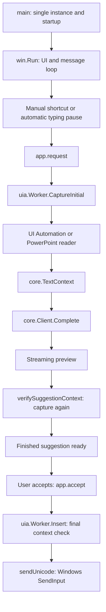

**TypeNext code structure report**

TypeNext is a Windows x64 desktop application that reads text around an approved textbox's caret, requests an AI continuation, displays a floating preview, and inserts the continuation when the user accepts it. Its implementation uses Go's standard library and Windows APIs, with no external Go module dependencies.

This report describes the implementation and supporting files in the working tree. The generated `TypeNext.exe` is ignored by version control.

All paths below are relative to the repository root. Source links are relative to this document. Function names such as `app.request()` mean methods on the named type; small related helpers are grouped by purpose.

The application is organized into these Go packages:

| Location | Responsibility | Dependencies within the project |
|---|---|---|
| `cmd/typenext` | Executable entry point and embedded executable resources. | `internal/win` |
| `internal/win` | Windows UI, keyboard/mouse hooks, PowerPoint adapter, preview, insertion, and encrypted key storage. | `internal/core`, `internal/win/uia`, `internal/win/com` |
| `internal/win/uia` | UI Automation worker, focused-text reads, diagnostics, caret identity, and geometry. | `internal/core`, `internal/win/com` |
| `internal/win/com` | Shared COM calls, reference handling, and native COM types. | None |
| `internal/core` | Portable configuration, endpoint policy, model requests, text processing, and shortcut management. | None |

`cmd/typenext`, `internal/win`, and its subpackages require the `windows && amd64` build target. `internal/core` can be built and tested on other operating systems. The application state remains in `win`; `uia` receives native focus, process, IME, caret, input, and PowerPoint operations through `uia.Host` callbacks, so it does not import its parent package.

`Run()` keeps windows, input hooks, and message handling on one locked OS thread. The bridge in `internal/win/accessibility_windows.go` supplies native callbacks to `uia.New(host)`, which creates another locked thread initialized for COM's multithreaded apartment, where accessibility work is serialized. Model requests run in background goroutines. `app.post()` returns work to the UI thread; request-specific updates pass through `postRequest()` and `updateRequest()` to reject outdated results.

The main data structures connect these stages:

| Type | What it carries or owns |
|---|---|
| `core.Config` | Provider/model settings, context limits, approved applications, shortcut settings, remote permissions, and encrypted keys indexed by endpoint. |
| `core.TextContext` | Prefix/suffix text, window and focused-element identifiers, logical caret identity, process name, and preview coordinates. `ContextJSON()` sends only the prefix and suffix as document context. |
| `core.Client` | HTTP transport and an injected key-decryption function. |
| `core.HotkeySet` | A platform registrar and active shortcut registrations. Requested bindings are passed to `Apply()`, which returns per-action registration results. |
| `win.app` | Window/control handles, settings, model/accessibility services, cancellation and revision state, the captured context, and the current suggestion. |
| `uia.Worker` / `uia.caretIdentity` | Serialized accessibility jobs and the logical caret baseline used to verify one request. |
| `uia.Host` | Native Windows and PowerPoint callbacks supplied by the application to the accessibility worker. |
| `win.pptCaret` | PowerPoint text-range objects and presentation/slide/shape/caret identity. |

The executable starts in [cmd/typenext/main_windows.go](../cmd/typenext/main_windows.go). Its `main()` acquires the single-instance guard, calls `win.Run()`, and reports startup errors or a panic on the main goroutine through `win.ShowFatal()`.

The portable implementation lives in `internal/core`:

| File | Feature | Main functions and their targets |
|---|---|---|
| [config.go](../internal/core/config.go) | Settings, defaults, validation, application approval, and persistence. | `DefaultConfig()` supplies defaults. `Config.Validate()` checks providers, URLs, model/settings bounds, shortcuts, and saved-key structure. `Config.Allows()` applies the executable allowlist and built-in blocklist. `ConfigPath()` finds the user config location. `LoadConfig()` overlays saved JSON on defaults and validates it. `SaveConfig()` validates and saves through a temporary file and rename. Also defines `Config` and `Version`. |
| [endpoint.go](../internal/core/endpoint.go) | Endpoint construction, remote approval, and request policy. | `LocalBase()` validates loopback URLs. `ServerBase()` validates and canonicalizes URLs, requiring HTTPS for remote servers. `Config.RequestURL()` constructs the complete protocol endpoint. `IsRemote()` classifies endpoints. `CheckConsent()` requires approval matching the exact canonical remote request URL. `AutomaticAllowed()` combines automatic mode and remote permissions; `AutomaticDue()` adds a three-second remote interval. `Clone()` copies mutable settings. `ValidateAPIKey()` validates credential format. |
| [client.go](../internal/core/client.go) | Ollama and OpenAI-compatible inference. | `NewClient()` creates an HTTP client with certificate validation, TLS 1.2 minimum, redirects disabled, and environment proxies disabled. `Client.apiKey()` selects an endpoint-bound saved key or the configured environment key. `Client.Complete()` checks settings/consent, bounds context, constructs requests, applies timeout/cancellation, parses streamed or ordinary responses, and emits cleaned partial/final text. `safeStreamError()` and `apiHTTPError()` produce errors without exposing response bodies. |
| [text.go](../internal/core/text.go) | Text limits, model instructions, suggestion cleanup, and context identity. | `TextContext.Fingerprint()` hashes target identity and surrounding text for comparison. `Head()` / `Tail()` keep the first/last N Unicode code points and clone clipped strings to avoid retaining a large source string. `ContextJSON()` serializes prefix/suffix. `CleanSuggestion()` removes thinking blocks, model markers, exact context echoes, and control characters; converts line/tab separators to spaces; rejects fenced/empty output; and caps length. `SystemPrompt` defines the inline-completion instruction. |
| [hotkeys.go](../internal/core/hotkeys.go) | Shortcut syntax and registration lifecycle. | `ParseHotkey()` validates and parses shortcut strings. `Hotkey.Enabled()`, `Matches()`, and `String()` inspect, match, and format keys. `Config.HotkeyBindings()` creates Suggest/Accept/Pause bindings and rejects duplicates. `NewHotkeySet()` injects a platform registrar. `HotkeySet.Apply()` preserves unchanged keys, supports swaps, and reports conflicts per action. `Active()` / `Matches()` query registrations; `Close()` releases them. |
| [presets.go](../internal/core/presets.go) | Provider defaults for the API settings dialog. | `APIPresets()` returns `APIPreset` entries for local Ollama, local compatible servers, OpenAI, DeepSeek, OpenRouter, and custom compatible APIs. Presets provide connection/request defaults; endpoint approval is handled separately. |

The Windows application's coordinator is [internal/win/app_windows.go](../internal/win/app_windows.go). It defines `app` and owns startup, main settings, asynchronous request state, event dispatch, tray behavior, preview rendering, and acceptance:

| Main functions | Target behavior |
|---|---|
| `Run()` | Load settings; initialize accessibility, HTTP client, fonts/icons/windows, shortcuts, tray icon, hooks, and timer; run the Windows message loop. Inject `unprotectAPIKey()` into the client. |
| `SingleInstance()` / `ShowFatal()` | Use a named mutex for one instance per logon session; display fatal errors. |
| `app.buildSettings()` | Create the main settings interface for connection, interaction, context limits, approved apps, and tools. |
| `app.readSettings()` / `save()` | Read controls, parse numbers/application names, validate settings, obtain remote approval when needed, persist changes, and refresh active configuration. |
| `app.s()`, `makeFont()`, `control()`, `controlIn()`, `label()`, `button()`, `checkbox()`, `separator()` | Scale dimensions and construct native controls. `windowText()` and `checked()` read control values; `isSettingsChild()` supports settings keyboard navigation. |
| `app.post()` / `postRequest()` / `updateRequest()` | Marshal background updates to the UI thread and guard request updates with revision and foreground-window checks. |
| `app.invalidate()` | Advance the revision, cancel outstanding work, clear acceptance/snapshot state, hide the preview, and optionally arm a new automatic attempt. |
| `app.request(manual)` | Check permissions/pause state; capture context; reject stale or empty-prefix captures; stream a model result; verify the context again; mark the result acceptable only after verification. |
| `app.accept()` | Require a finished candidate and the expected foreground window, hide the preview, and invoke `uia.Worker.Insert()` asynchronously. |
| `app.tick()` | Poll foreground changes, run delayed inspection, and start a due automatic request after app approval and IME/modifier checks. The timer is configured for 150 ms. |
| `app.toggle()` | Pause/resume completion and invalidate the current request. |
| `app.testModel()` / `startModelTest()` | Test the configured model using a fixed sample sentence. Track an in-progress test and avoid displaying its result as a test of subsequently changed connection settings. |
| `app.inspect()` | Inspect focused-control metadata and display capabilities, editability evidence, and operation/HRESULT failures without reading field text or calling the model. |
| `app.openPad()` | Create or focus the built-in sample editor using `createPadEdit()`. |
| `windowProc()` | Dispatch control commands, global hotkeys, timer ticks, background jobs, tray actions, and painting/window lifecycle messages. |
| `keyboardProc()` / `app.consumeAcceptedTab()` | Detect user keyboard activity, skip injected events/owned shortcuts, handle Escape and Tab acceptance, and consume an accepted Tab's repeats until key release. |
| `mouseProc()` | Invalidate the current request on relevant mouse button/wheel activity. |
| `app.trayMessageValue()`, `trayData()`, `addTray()`, `removeTray()`, `trayMenu()`, `showSettings()` | Register tray recovery messages, manage tray resources/menu actions, and reopen settings. |
| `app.setStatus()` / `notify()` | Update status text and show tray notifications. |
| `app.showOverlay()` / `paintOverlay()` / `hideOverlay()` | Size and position the preview within the monitor work area, paint suggestion/model/instruction text, and clear it. The preview does not take keyboard focus. |

The other Windows interaction and settings files support that coordinator:

| File | Feature | Main functions and their targets |
|---|---|---|
| [automatic_windows.go](../internal/win/automatic_windows.go) | Suggestions after a typing pause. | `automaticTypingKey()` classifies typing/editing keys, allowing Shift while excluding Ctrl/Alt/Windows command combinations. `app.keyboardActivity()` associates input with its foreground window and invalidates/arms completion. `observeForeground()` cancels stale work after a window change. `automaticDue()` combines enabled/dialog/running state, debounce time, and core remote-request policy. |
| [automatic_status_windows.go](../internal/win/automatic_status_windows.go) | Explain why saved automatic settings are blocked. | `automaticBlockReason()` returns a status explanation when automatic remote permission or endpoint approval is missing. |
| [suggestion_windows.go](../internal/win/suggestion_windows.go) | Verification, failure display, and dismissal. | `verifySuggestionContext()` captures again and compares fingerprints; it tries unavailable reads up to three times, but rejects an actual mismatch immediately. `app.failSuggestion()` invalidates the request and leaves a visible, non-acceptable failure message. `dismissSuggestion()` clears an active preview/request and reports whether it handled dismissal. |
| [api_windows.go](../internal/win/api_windows.go) | API configuration interface and endpoint approval. | `app.openAPI()` / `closeAPI()` manage the dialog. `apiConnectionFields()` reads current connection fields. `useAPIPreset()` fills explicit provider defaults. `updateAPIKeyStatus()` describes saved-key availability for the draft endpoint. `approveRemote()` obtains approval for the exact request URL. `saveAPI()` validates fields, manages saved keys, persists settings, and updates active state. `connectionSummary()` / `refreshConnectionUI()` update the main connection description; `apiMessage()` displays dialog status. `setControlText()`, `setCheck()`, `comboIndex()`, and `selectCombo()` manipulate native controls. |
| [hotkeys_windows.go](../internal/win/hotkeys_windows.go) | Windows shortcut registration and shortcut settings. | `windowsHotkeyRegistrar.Register()` / `Unregister()` wrap native global-hotkey APIs. `currentModifiers()` reads Ctrl/Alt/Shift/Windows state. `app.applyHotkeys()` applies configured bindings. `openShortcuts()`, `closeShortcuts()`, `resetShortcutFields()`, and `saveShortcuts()` manage editing and persistence. `hotkeyWarning()`, `hotkeyLabel()`, `acceptHint()`, `acceptShortcutLabel()`, and `refreshHotkeyUI()` keep labels consistent with actual registrations. |
| [layout_windows.go](../internal/win/layout_windows.go) | Shared settings-window sizing and status styling. | `app.createSettingsWindow()` creates a window sized for the requested client area. `separatorIn()` creates section dividers. `statusText()` creates tagged status controls whose colors are applied by `windowProc()`. |
| [pad_windows.go](../internal/win/pad_windows.go) | Accessible built-in test editor. | `createPadEdit()` loads the Windows Rich Edit control, creates a plain-text multiline editor, and initializes its sample text. |
| [icon_windows.go](../internal/win/icon_windows.go) | Runtime application and tray icons. | `loadAppIcon()` loads the embedded icon resource at the requested system icon size. |
| [secrets_windows.go](../internal/win/secrets_windows.go) | Windows-protected API-key storage. | `protectAPIKey()` encrypts a validated key with current-user DPAPI and endpoint-specific entropy. `unprotectAPIKey()` decodes/decrypts a saved key using the same endpoint scope. `blob()` bridges Go bytes to DPAPI buffers; `zero()` clears sensitive byte buffers. |
| [native_windows.go](../internal/win/native_windows.go) | Windows DLL bindings, native structures, focus/IME checks, and insertion. | `processOf()` identifies the foreground executable. `guiInfo()` reads GUI-thread focus/caret data. `composing()` detects active IME composition. `nativeCaret()` converts native caret geometry to screen coordinates. `sendUnicode()` constructs Unicode key events and calls `SendInput`. `waitRelease()` waits for acceptance keys/modifiers to be released. `foreground()`, `keyDown()`, `modifiersDown()`, and `u16()` provide common OS helpers. Defines native structures such as `rect`, `msg`, `keyboardHook`, `input`, and `notifyIconData`. |
| [abi_assert_windows.go](../internal/win/abi_assert_windows.go) | Compile-time Windows x64 memory-layout validation. | No runtime functions. Assertions check sizes/offsets of native structures so an incompatible Go layout fails compilation. |

UI Automation implementation and its tests live in `internal/win/uia`. PowerPoint remains in `internal/win`, and both packages use the shared `internal/win/com` helpers:

| File | Feature | Main functions and their targets |
|---|---|---|
| [accessibility_windows.go](../internal/win/accessibility_windows.go) | Application bridge to the UI Automation package. | Constructs `uia.Host` with native Windows and PowerPoint callbacks and creates the worker through `uia.New(host)`. |
| [uia_windows.go](../internal/win/uia/uia_windows.go) | Accessibility worker, main context capture, and final insertion checks. | `uia.New(host)` initializes the dedicated COM worker. `uia.Worker.CaptureInitial()` starts a fresh identity baseline; `Capture()` retains it for verification; `capture()` queues work and waits with cancellation. `readContext()` enforces application approval and safe focused-control/selection checks, reads bounded text, determines identity/position, and rechecks focus. `Insert()` waits for key release, verifies revision/context again, sanitizes text, and inserts through the host callback. |
| [uia_windows.go](../internal/win/uia/uia_windows.go), range helpers | UIA property and range utilities. | `scalar()` reads scalar properties; `pattern()` obtains an interface. `cloneRange()` and `moveEnd()` support range handling. `safeArrayData()` accesses checked SAFEARRAY contents. `focusID()` reads UIA runtime identity; `rangeRect()` extracts range geometry. |
| [uia/native_windows.go](../internal/win/uia/native_windows.go) | UIA native bindings and shared COM bridge. | Declares the COM DLL procedures, native types, and aliases used inside the UIA package. |
| [com/com_windows.go](../internal/win/com/com_windows.go) | Shared COM calls and types. | Provides COM vtable invocation, HRESULT checks, reference release, and native object, GUID, and VARIANT definitions. |
| [com_windows.go](../internal/win/com_windows.go) | Application bridge to shared COM helpers. | Keeps aliases and wrappers used by the PowerPoint adapter and application native structures. |
| [uia_focus_windows.go](../internal/win/uia/uia_focus_windows.go) | Focused text capabilities and editability. | `validateTextElement()` checks protection, focus, and enabled state. `caretEditability()` accepts writable text attributes or, only for the exact unsupported token, writable ValuePattern metadata from the same field. Explicit read-only, mixed values, and provider failures reject capture. |
| [uia_target_windows.go](../internal/win/uia/uia_target_windows.go) | Direct and scoped TextChild target resolution. | `resolveTextTarget()` retains the focused field and text-owner identities. TextChild requires a writable field and an enclosing range belonging to that field. `rangeWithinBoundary()` and `clampRangeToBoundary()` constrain reads. `verifyTextTarget()` rechecks identities, boundaries, editability, and collapsed selection. |
| [uia_diagnostics_windows.go](../internal/win/uia/uia_diagnostics_windows.go) | Metadata-only inspection. | `uia.Worker.Inspect()` uses the COM worker and application approval. The report includes framework/class, pattern availability, selection support, editability evidence, and operation/HRESULT failures. It never requests Name, Value, ProviderDescription, or GetText. |
| [uia_client_windows.go](../internal/win/uia/uia_client_windows.go) | UI Automation client creation and native timeouts. | `createAutomationClass()` wraps `CoCreateInstance`. `createUIAutomation()` creates the newer automation client with 1,000 ms connection and 1,500 ms transaction timeouts. It falls back to the legacy client only when the newer class/interface is unavailable. |
| [uia_context_windows.go](../internal/win/uia/uia_context_windows.go) | Bounded text adjacent to the caret and safe selection reads. | `boundedRangeText()` reads bounded UTF-16 text and reports whether the requested range was complete. `readCaretSide()` reads prefix/suffix ranges while preserving adjacency to the caret when providers promote character movement to larger units. `collapsedSelection()` requires exactly one empty selection. `verifyCaretSelection()` rechecks that the selection/caret still matches after reading. |
| [uia_identity_windows.go](../internal/win/uia/uia_identity_windows.go) | Caret identity independent of popup coordinates. | `caretIdentity.identifyInPattern()` selects an exact offset or retained-range identity and keeps the chosen scheme stable during a request. `identify()` compares/clones retained ranges and advances a serial when the caret changes. `compareRangeEndpoints()` compares both endpoints with explicit errors; `sameRangeEndpoints()` returns a boolean. `close()` releases the retained baseline. |
| [uia_position_windows.go](../internal/win/uia/uia_position_windows.go) | Stable logical caret offsets across provider recreation. | `stableCaretOffset()` moves a cloned range toward document start and verifies the round trip to the original caret. It uses at most 8,192 character units, reads no text, and returns failure when exact positioning cannot be established. Despite the filename, this handles logical position rather than screen coordinates. |
| [uia_geometry_windows.go](../internal/win/uia/uia_geometry_windows.go) | Visual caret-position fallback. | `adjacentCaretPosition()` estimates a popup anchor from a character range next to the caret when the empty caret range has no usable rectangle. It respects cancellation. |
| [powerpoint_windows.go](../internal/win/powerpoint_windows.go) | PowerPoint slide text through the native Office object model. | `readPowerPointContext()` finds the focused native editing pane, captures bounded slide text, computes identity/geometry, and rechecks selection/focus. `pptFocusedPane()` / `pptPaneFromFocus()` follow ancestors of the actual keyboard focus; `pptWindowClass()` identifies supported pane classes. `pptSelection()` validates supported editing state and creates a `pptCaret`. `pptContextText()`, `pptTextSpan()`, and `pptString()` read bounded character slices. `pptRangePosition()` converts Office text-range coordinates to screen position. |
| [powerpoint_windows.go](../internal/win/powerpoint_windows.go), COM helpers | Late-bound Office property/method access and caret metadata. | `pptInvoke()` performs `IDispatch` invocation; `pptObject()`, `pptInteger()`, and `pptNumber()` extract typed results. `pptIntArg()` / `pptFloatArg()` prepare arguments. `pptCaret.identity()` identifies presentation/slide/shape/insertion position; `close()` releases owned ranges. |

For a normal accessible textbox, `readContext()` requires an approved application, no active IME composition, a focused/enabled non-password control, and a collapsed selection. Direct TextPattern is preferred. TextChild may resolve an explicitly related container only with a writable ValuePattern on the focused child and a range whose enclosing element matches that child. Context and adjacent-glyph geometry probes are clamped to this range. Text editability must be explicit, with a same-field ValuePattern fallback only for UIA's exact unsupported token. It prefers a matching active TextPattern2 caret, reads bounded context, then re-resolves and checks field/container identity, boundaries, selection, and editability. Scoped TextChild captures retain caret ranges instead of computing offsets from a parent document.

Logical identity and popup geometry are deliberately separate. `TextContext.Fingerprint()` ignores X/Y when a logical `CaretID` exists; without one, coordinates remain part of the comparison. Screen positioning tries the native caret, the UIA caret rectangle, an adjacent character rectangle, and finally a field-corner anchor. `Insert()` skips UIA geometry collection during its final check.

The worker invokes the host's `readPowerPointContext()` callback when the approved foreground executable is `powerpnt.exe`. It supports validated slide-text editing in ordinary textboxes, placeholders, and autoshapes; it rejects complex containers such as groups, tables, charts, and SmartArt. It has its own native-caret, text-range, and pane-corner positioning chain. A PowerPoint reader error is returned to the caller; there is no generic UIA fallback for that branch. The PowerPoint branch also runs its positioning logic during insertion verification.

The existing portable test files cover these behaviors. The named tests below are representative entry points; related cases remain in the same file.

| Test file | Main tests and purpose |
|---|---|
| [internal/core/core_test.go](../internal/core/core_test.go) | `TestLocalBase`, `TestConfiguration`, `TestConfigBounds`, and `TestAllowlist`: URL/configuration/application-policy behavior. `TestTextCleaning` and `TestContextFingerprint`: text sanitation and legacy identity checks. `TestOllamaStreaming`, `TestOpenAICompatibleStreaming`, `TestHTTPFailures`, `TestCancellation`, `TestNoProxy`, and `TestAPIKeyFromEnvironment`: mock-server protocol, error, cancellation, and authentication behavior. |
| [internal/core/api_test.go](../internal/core/api_test.go) | `TestRemoteConsentBeforeNetworkOrKey`, `TestRemoteURLValidation`, and `TestEndpointConstruction`: remote policy. `TestRemoteHTTPSStreamingAndAuthentication`, `TestRemoteTLSCertificateRequired`, `TestRemoteRedirectBlocked`, and `TestSavedKeyBindingAndPrecedence`: transport/key handling. `TestKeyDecryptionFailureDoesNotFallbackOrLeak`: saved-key failure behavior. `TestCompatibleResponseVariants`, `TestRequestOptionsByProvider`, `TestResponseLimits`, and `TestStreamingMetadataDoesNotRepeatPartial`: response/request handling. Also tests persistence, presets, separate remote-auto permission, and throttling. |
| [internal/core/hotkeys_test.go](../internal/core/hotkeys_test.go) | `TestHotkeyParsing`, `TestHotkeyRejectsUnsafeOrInvalidBindings`, and `TestHotkeyMatchesExactly`: shortcut syntax/matching. `TestHotkeyConflictIsNonfatal`, `TestHotkeySwapAndDisable`, and `TestHotkeyReleaseFailureDoesNotForgetActiveKey`: registration behavior through a fake registrar. Also covers defaults, duplicates, unchanged registrations, and recovery from conflicts. |
| [internal/core/text_identity_test.go](../internal/core/text_identity_test.go) | `TestPowerPointApprovalPreservesSavedAllowlist`: new defaults preserve explicit saved permissions. `TestLogicalCaretIgnoresPlacementChanges`: geometry can change while logical identity remains stable. `TestContextJSONExcludesCaretIdentity`: document payload contains only prefix/suffix. |

The existing Windows test files cover native structures, accessibility contracts, and suggestion state:

| Test file | Main tests and purpose |
|---|---|
| [internal/win/abi_windows_test.go](../internal/win/abi_windows_test.go) | `TestWindowsX64ABI`: verifies expected native structure sizes and field offsets at runtime. |
| [internal/win/automatic_windows_test.go](../internal/win/automatic_windows_test.go) | `TestAutomaticTypingKeys`: classifies typing versus command/navigation keys. `TestAutomaticPauseSurvivesShiftedFinalKeyAndRelease`: preserves a pause after shifted typing. `TestAutomaticTypingAfterWindowSwitchSurvivesFirstPoll`: associates typing with its new window. `TestAutomaticNonTypingActivityCancelsPendingPause` and `TestAutomaticPauseHonorsAppAndRemoteGates`: invalidation and eligibility checks. |
| [internal/win/automatic_status_windows_test.go](../internal/win/automatic_status_windows_test.go) | `TestAutomaticStatusExplainsSavedButBlockedDelay`: displays an explanation when saved automatic settings cannot currently trigger remote requests. |
| [internal/win/com/com_windows_test.go](../internal/win/com/com_windows_test.go) | `TestCOMCallArguments`: validates COM argument forwarding and HRESULT handling with fake vtables. `BenchmarkCOMCall`: measures wrapper overhead. |
| [internal/win/pad_windows_test.go](../internal/win/pad_windows_test.go) | Checks that the production `createPadEdit()` control is initialized in plain-text mode. |
| [internal/win/uia/pad_windows_test.go](../internal/win/uia/pad_windows_test.go) | `TestPadAccessibilityText`: creates a hidden Windows editor fixture and checks UIA text-pattern access, prefix/suffix reads, Unicode, and selection state. `testPadControl()` / `readTestPadRanges()` provide native-control helpers within the UIA package. |
| [internal/win/powerpoint_windows_test.go](../internal/win/powerpoint_windows_test.go) | `TestPowerPointBoundedContext` and `TestPowerPointContextEdgesAndUnicode`: bounded Office text reads. `TestPowerPointRejectsUnsafeSelectionsBeforeText` and `TestPowerPointRejectsClampedRangeBeforeText`: reject unsupported/ambiguous reads. `TestPowerPointCaretIdentitySeparatesPositions`, `TestPowerPointDispatchABI`, and `TestPowerPointGeometryConvertsPointsToScreen`: identity, dispatch layout, and geometry. Uses fake Office dispatch objects rather than a live presentation. |
| [internal/win/secrets_windows_test.go](../internal/win/secrets_windows_test.go) | `TestDPAPIEndpointBoundRoundTrip`: real DPAPI encrypt/decrypt and endpoint binding. `TestDPAPIRejectsBadInputs`: rejects invalid key/ciphertext inputs. |
| [internal/win/suggestion_windows_test.go](../internal/win/suggestion_windows_test.go) | `TestSuggestionVerificationRecoversFromUnavailableRead`, `TestSuggestionVerificationRejectsChangedContextWithoutRetry`, and `TestSuggestionVerificationStopsWhenRequestCanceled`: verification policy. `TestFailedSuggestionStaysVisibleButCannotBeAcceptedOrRevived`: failure state. `TestRequestUpdatesCannotFlashAfterFocusChanges`, `TestSupersededRequestCannotCancelCurrentSuggestion`, and `TestRequestUpdateRejectsInputRevisionAndMissingWindow`: stale callback guards. `TestAcceptedTabRepeatsStayConsumedUntilRelease`: acceptance-key repeat handling. |
| [internal/win/uia/uia_client_windows_test.go](../internal/win/uia/uia_client_windows_test.go) | `TestUIAutomationInitialization`: client creation/fallback behavior with fake COM objects. `TestUIAutomationNativeTimeouts`: native automation-client timeout settings. |
| [internal/win/uia/uia_context_windows_test.go](../internal/win/uia/uia_context_windows_test.go) | `TestReadCaretPrefixKeepsCaretAdjacencyWithPromotedUnits`, `TestReadCaretPrefixRejectsOversizedSingleUnit`, and `TestReadCaretSuffixAllowsFarEndTruncation`: text boundaries with provider-specific movement. Also covers zero context, Unicode/embedded NUL, cancellation, and `TestVerifyCaretSelectionAfterRead`. |
| [internal/win/uia/uia_diagnostics_windows_test.go](../internal/win/uia/uia_diagnostics_windows_test.go) | `TestInspectionMetadataDoesNotReadContent` and `TestInspectionResolvesCaretWithoutReadingText`: inspect metadata and caret support without reading field text. Also covers protection, cancellation, unavailable properties, and diagnostic failures. |
| [internal/win/uia/uia_focus_windows_test.go](../internal/win/uia/uia_focus_windows_test.go) | `TestFocusedTextPatternUsesCapabilities`: capability-based control recognition. `TestCaretEditabilityRequiresPositiveEvidence` and `TestCaretEditabilityFallbackAndConflicts`: writable text evidence and restricted ValuePattern fallback. Also checks protection ordering and native UIA attribute tokens. |
| [internal/win/uia/uia_geometry_windows_test.go](../internal/win/uia/uia_geometry_windows_test.go) | `TestUIACaretFingerprintWithoutPosition`: identity independent of the visual anchor. `TestAdjacentCaretPosition` and `TestAdjacentCaretPositionCancellation`: geometry fallback and cancellation with fake ranges. |
| [internal/win/uia/uia_identity_windows_test.go](../internal/win/uia/uia_identity_windows_test.go) | `TestCaretIdentityAcrossCaptures`: stable retained-range identities. `TestCaretIdentityPreservesSnapshotOnProviderFailure` and `TestCaretIdentityRejectsMovementAfterProviderFailure`: retain a baseline on temporary errors without accepting later movement. `TestCaretComparisonRequiresBothEndpoints`: compare the entire collapsed range. |
| [internal/win/uia/uia_position_windows_test.go](../internal/win/uia/uia_position_windows_test.go) | `TestStableCaretOffsetAcrossProviderRecreation` and `TestStableCaretOffsetDistinguishesRepeatedTextPositions`: offset identity. `TestStableCaretOffsetRejectsUnverifiedPositions`, `TestStableCaretOffsetLimitExhaustion`, and `TestStableCaretOffsetRejectsMissingInterfaces`: conservative failure paths. `TestStableCaretOffsetWithWindowsProvider`: verifies offset behavior against a real Windows editor control. |
| [internal/win/uia/uia_target_windows_test.go](../internal/win/uia/uia_target_windows_test.go) | `TestResolveTextTargetUsesVerifiedChildBoundary` and `TestResolveTextTargetRejectsUnverifiedChildScope`: scoped TextChild resolution. `TestReadCaretSideWithinClampsBeforeReading` and `TestRangeWithinBoundaryAllowsEdgesAndRejectsEscape`: context remains inside the verified field boundary. |

Repository support files provide build, packaging, configuration examples, and documentation:

| File | Purpose / principal action |
|---|---|
| [go.mod](../go.mod) | Declares module `typenext` and Go language version `1.23`; contains no external module requirements. |
| [config.example.json](../config.example.json) | Documents factory settings, including local Ollama, context/output limits, approved applications, default shortcuts, and disabled remote/automatic permissions. Actual user settings live at `%APPDATA%\TypeNext\config.json` on Windows. |
| [scripts/Build.ps1](../scripts/Build.ps1) | Sets Windows/amd64 and disables CGO; runs `go test ./...` and `go vet ./...`; builds a stripped GUI executable with trimmed paths; prints its SHA-256. Optional `-Run` launches the result. |
| [scripts/build.sh](../scripts/build.sh) | Runs portable core tests/vet, vets Windows sources, and cross-builds `TypeNext.exe` for Windows x64. It does not execute Windows UI tests on the host. |
| [.github/workflows/build.yml](../.github/workflows/build.yml) | GitHub Actions workflow for pushes, pull requests, and manual dispatch. Runs the PowerShell build on Windows and uploads the executable plus the listed documentation/configuration/licenses. |
| [.gitignore](../.gitignore) | Excludes generated binaries, test/coverage artifacts, local workspace files, `.env`, and temporary OS files. |
| [assets/typenext.rc](../assets/typenext.rc) | Windows resource definition mapping icon resource ID `1` to `typenext.ico`; that ID matches `loadAppIcon()`. |
| [assets/typenext.ico](../assets/typenext.ico) | Application icon asset used by the resource definition. |
| [cmd/typenext/icon_windows_amd64.syso](../cmd/typenext/icon_windows_amd64.syso) | Compiled Windows amd64 resource object linked into the executable by Go. The current build scripts consume this checked-in object and do not regenerate it. |
| [assets/logo.png](../assets/logo.png) | Standalone logo image. No current application/build code references this PNG directly. |
| [README.md](../README.md) | User-facing overview, setup instructions, controls, application approval, operational limitations, build instructions, and licensing summary. |
| [docs/SOURCES.md](SOURCES.md) | Engineering reference links for Windows APIs, accessibility, PowerPoint, model protocols, and key protection. |
| [LICENSE](../LICENSE) | MIT license for TypeNext. |
| [THIRD_PARTY_GO_LICENSE.txt](../THIRD_PARTY_GO_LICENSE.txt) | License notice for the statically linked Go runtime/standard library. |
| `TypeNext.exe` (generated, ignored) | Built desktop application in the repository root. Its presence does not establish that it matches the current source tree. |
| [docs/CODE_STRUCTURE.md](CODE_STRUCTURE.md) | This file: implementation responsibilities, function targets, execution flow, and test/build inventory. |

To locate implementation work by feature, start with these files:

| Intended change | Primary implementation locations |
|---|---|
| Change the model prompt or output cleanup | `internal/core/text.go`; request options/stream parsing in `internal/core/client.go`. |
| Add provider defaults or connection settings | `internal/core/presets.go`, `config.go`, `endpoint.go`, `client.go`; API interface in `internal/win/api_windows.go`. |
| Change automatic-trigger timing or typing classification | `internal/win/automatic_windows.go`, `app_windows.go` (`keyboardProc()` / `tick()`), and `internal/core/endpoint.go` for remote throttling. |
| Change how a focused textbox is read | `internal/win/uia/uia_windows.go` and `internal/win/uia/uia_context_windows.go`. |
| Fix stale-caret or repeated-text identity behavior | `internal/win/uia/uia_identity_windows.go`, `internal/win/uia/uia_position_windows.go`, and `internal/core/text.go`. |
| Change popup placement or appearance | `internal/win/uia/uia_geometry_windows.go`, `internal/win/native_windows.go`, and `app_windows.go` (`showOverlay()` / `paintOverlay()`). |
| Change PowerPoint support | `internal/win/powerpoint_windows.go`. |
| Change acceptance, cancellation, or failure behavior | `internal/win/app_windows.go`, `suggestion_windows.go`, `internal/win/uia/uia_windows.go`, and `internal/win/native_windows.go`. |
| Change shortcuts | `internal/core/hotkeys.go` and `internal/win/hotkeys_windows.go`; Tab/Escape handling in `app_windows.go`. |
| Change key encryption or saved-key selection | `internal/win/secrets_windows.go`, `api_windows.go`, and `internal/core/client.go`. |
| Change packaging or build checks | `scripts/Build.ps1`, `scripts/build.sh`, `.github/workflows/build.yml`, and the icon resources. |

The runtime checks have two practical boundaries relevant to understanding the design. Accessibility depends on each application's provider and the dedicated PowerPoint adapter. Final verification followed by `SendInput` is not an atomic edit transaction across processes, so a small focus/edit race remains.

For project verification, the Windows build script runs all current tests and static analysis; the shell script runs portable tests and cross-build checks. Live application compatibility and actual model behavior require separate Windows testing.
